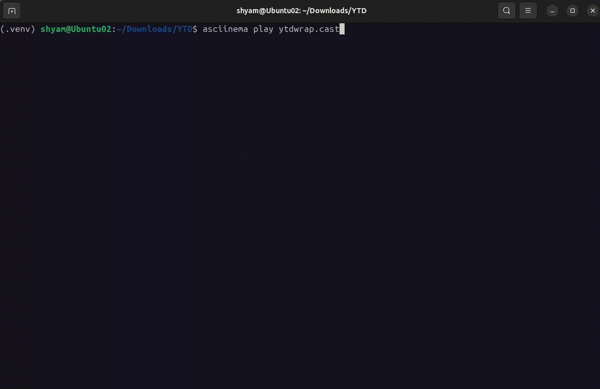
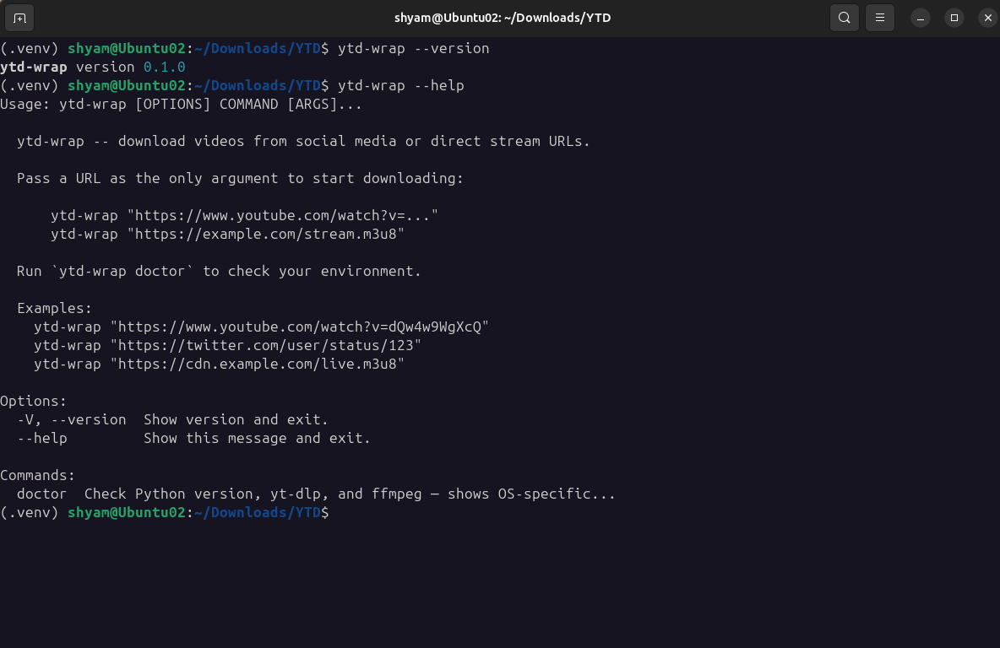
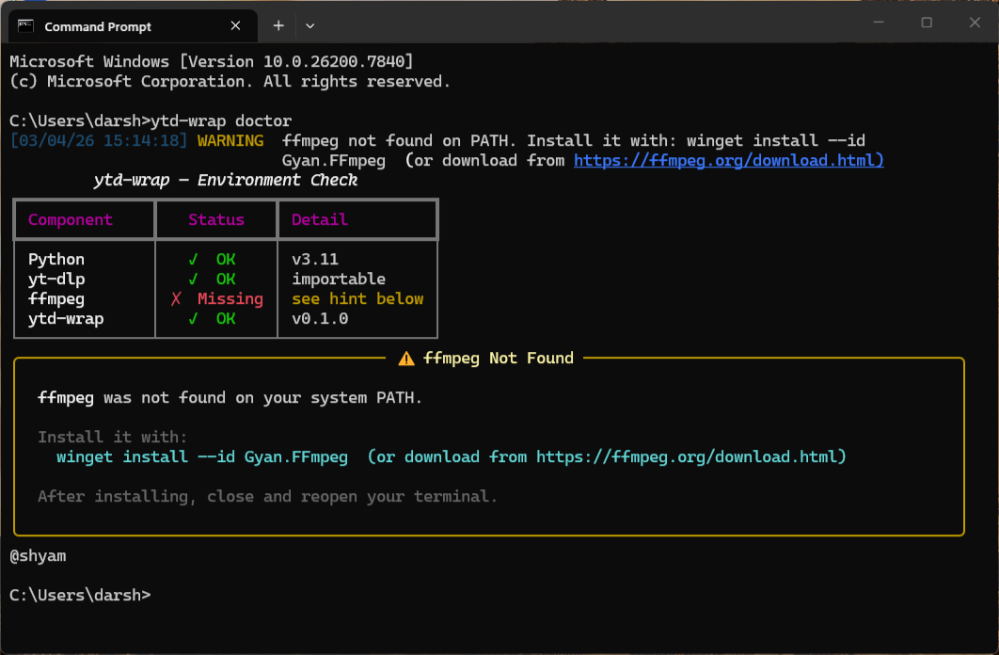
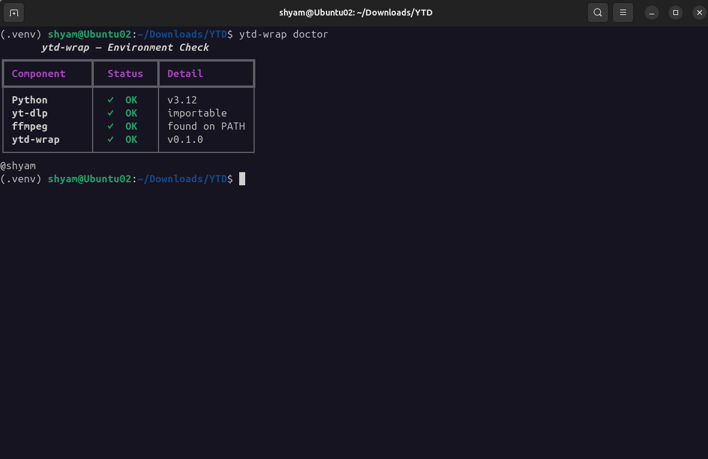

# ytd-wrap

> A multi-platform Python CLI for resilient social-media and direct-stream video acquisition, featuring intelligent format orchestration, interactive quality selection, dependency diagnostics, and robust download/error workflows.

Maintainer: **Shyam Darshanam** ([Shyam-Dev18](https://github.com/Shyam-Dev18))

[](https://pypi.org/project/ytd-wrap/)
[](https://pypi.org/project/ytd-wrap/)
[](LICENSE)



---

## Features

- **Arrow-key format selection** — pick resolution and codec interactively
- **Smart container selection** — mp4 for H.264/AAC, mkv for everything else
- **Rich terminal output** — progress bars, tables, and coloured panels
- **One-command doctor** — verifies all dependencies in one shot
- **Non-blocking update checks** — notified of new versions once per day
- **Graceful error handling** — actionable hints for age-restriction, geo-blocks, and missing ffmpeg



---

## Prerequisites

### Python 3.11 or newer

Download from <https://python.org/downloads/>.

### ffmpeg

ffmpeg must be on your system `PATH`.  Pick the instructions for your OS:

**macOS (Homebrew)**
```bash
brew install ffmpeg
```

**Windows (winget)**
```powershell
winget install --id Gyan.FFmpeg -e
```

**Windows (Chocolatey)**
```powershell
choco install ffmpeg
```

**Debian / Ubuntu**
```bash
sudo apt update && sudo apt install ffmpeg
```

**Fedora / RHEL**
```bash
sudo dnf install ffmpeg
```

Verify the installation:
```bash
ffmpeg -version
```



---

## Installation

```bash
pip install ytd-wrap
```

Or for development:

```bash
git clone https://github.com/example/ytd-wrap.git
cd ytd-wrap
pip install -e ".[dev]"
```

---

## Usage

### Download a social media video

```bash
ytd-wrap "https://www.youtube.com/watch?v=dQw4w9WgXcQ"
```

The tool will:
1. Fetch available formats and display them in a table
2. Let you pick resolution/quality with arrow keys
3. Download with a live progress bar
4. Report the saved file path

### Download a direct stream / m3u8

```bash
ytd-wrap "https://example.com/stream/video.m3u8"
ytd-wrap "https://example.com/video.mp4"
```

Direct URLs skip format selection and download with the best available quality automatically.

### Show version

```bash
ytd-wrap --version
```

### Check environment health

```bash
ytd-wrap doctor
```

Checks:
- Python version (3.11+ required)
- `yt-dlp` installed and importable
- `ffmpeg` found on PATH

Shows OS-specific install hints if anything is missing.



---

## Supported sites

ytd-wrap uses `yt-dlp` under the hood, which supports [1 000+ sites](https://github.com/yt-dlp/yt-dlp/blob/master/supportedsites.md) including:

| Platform | Notes |
|----------|-------|
| YouTube | Full format selection, age-gated content with cookies |
| Twitter / X | Videos from tweets |
| Instagram | Reels, posts, stories |
| TikTok | Public videos |
| Twitch | VODs and clips |
| Vimeo | Public videos |
| Direct URLs | `.m3u8`, `.mp4`, `.mkv`, `.webm`, `.ts` streams |

---

## Output format logic

| Video codec | Audio codec | Container |
|-------------|-------------|-----------|
| `h264` | `aac` | `.mp4` |
| `h264` | `mp4a` | `.mp4` |
| `vp9` | any | `.webm` |
| anything else | anything | `.mkv` |

Files are saved to `~/Downloads/` (falls back to `~/` if Downloads does not exist).

---

## 🤝 Contributing & Feedback

This package is for anyone who wants an easy way to download social media content.

It is currently in the development phase on PyPI.

Users are welcome to report issues, suggest improvements, and contributors are highly appreciated for helping maintain or resolve errors.

---

## License

MIT — see [LICENSE](LICENSE) for details.

